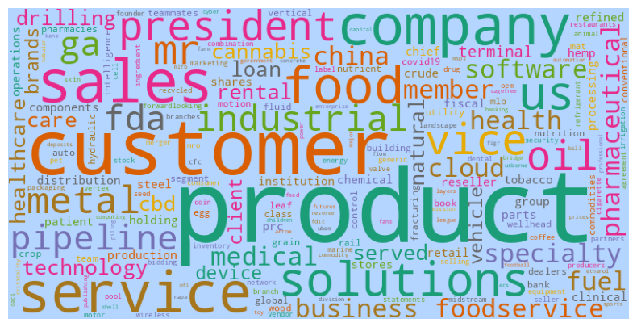
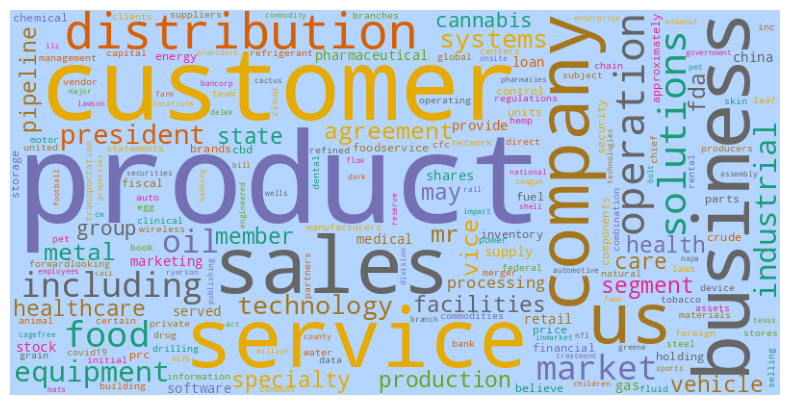
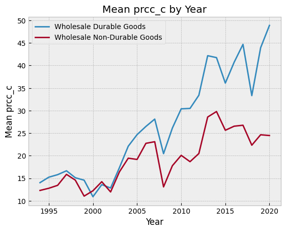
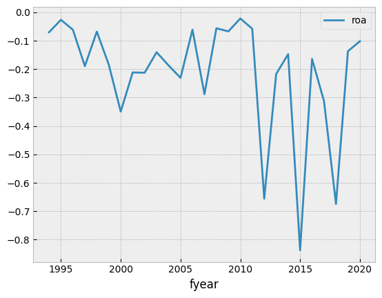
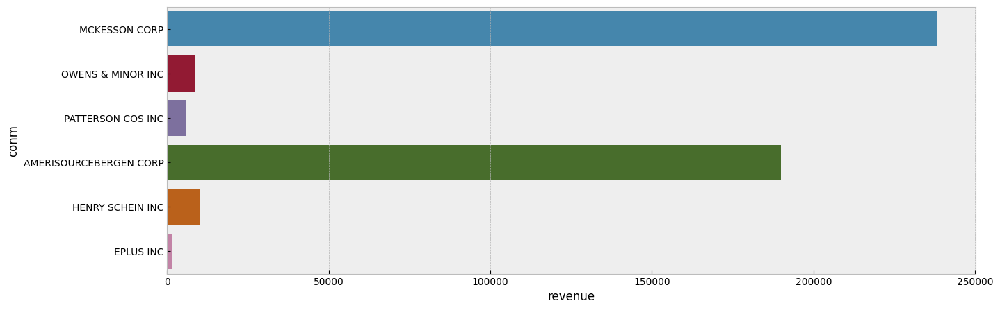
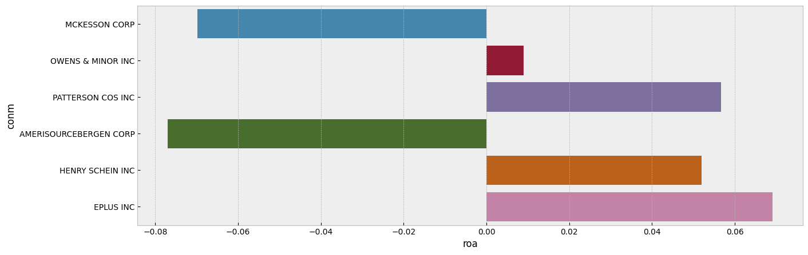
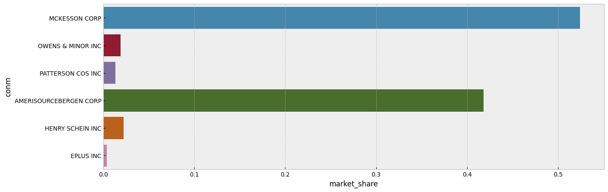

# NLP Analysis of 2020 10-K Reports — US Wholesale Industry

**Quantitative + NLP analysis of ~5,988 US public firms' 2020 10-K "Item 1" filings, combining 27-year financial trend analysis with TF-IDF keyword extraction and a Word2Vec embedding model trained on the filing corpus. Focus sector: wholesale (SIC 50/51, 640 firms).**



---

## Why 10-K filings

10-Ks are one of the only places where US public companies are legally forced to describe — on the record, under SEC scrutiny — what they sell, who they compete with, and what could go wrong. Item 1 ("Business") reads like a window into how a management team mentally models the business. Every analyst already reads these filings one at a time. I wanted to see whether NLP could surface industry-level structure you'd miss reading them individually: does a plain Word2Vec trained on pooled 10-K text learn the shape of an industry? Do the neighbors of "reseller" make sense? Can a document-similarity metric find competitors better than SIC codes do?

The project scopes to the US wholesale sector (SIC major groups 50 and 51 — durable and non-durable goods). Wholesale is unglamorous, high-volume, and macro-sensitive, which makes it a good test bed for "does this method actually see the industry, or is it just surfacing boilerplate."

## Pipeline

```
SEC EDGAR 10-K HTML
    -> Parse Item 1 (Business text)
    -> Clean: lowercase, strip punctuation, NLTK stopwords
    -> TF-IDF top-10 keywords per firm
    -> Word2Vec (gensim) trained on the cleaned corpus
    -> DocumentSimilarity: mean-pool Word2Vec vectors of each firm's
       top-10 TF-IDF keywords into one firm-level embedding
    -> Cosine-similarity nearest-competitor lookup
    +
public_firms.csv (1994-2020 panel, prcc_c, sale, ROA, SIC)
    -> Part 1 quantitative: industry trends, 2008 drawdown
```

Three notes on the pipeline:

1. The quantitative side (Part 1) and the NLP side (Part 2) stay separate until Part 3, where I use NLP-derived nearest competitors to benchmark one focal firm's fundamentals.
2. TF-IDF and Word2Vec are doing different jobs. TF-IDF identifies distinctive vocabulary. Word2Vec learns what words *mean* inside this corpus — the neighbors of "reseller" should be plausible wholesale terms.
3. `DocumentSimilarity` is the bridge. Take each firm's top TF-IDF keywords, mean-pool their Word2Vec vectors into one document embedding, cosine-similarity rank the universe.

## Data

- `public_firms.csv` — panel of US public firms, 1994–2020 (stock price `prcc_c`, sales `sale`, ROA derived from `ni/asset`, SIC codes, location)
- `major_groups.csv` — SIC major-group labels
- `2020_10K_item1_full.csv` — Item 1 text of 5,988 firms' 2020 10-K reports

For a production version of this you'd scrape EDGAR yourself with [`edgartools`](https://github.com/dgunning/edgartools) or `sec-edgar-downloader`. 10-K HTML is ugly — tables drift mid-sentence, footnotes render as paragraphs, page breaks show up as `<hr>` tags inside legal sentences, scanned signatures get embedded inside risk sections. If you strip tags naively you end up with text that reads like a ransom note. I got lucky here — the course provided a pre-parsed CSV so I could spend my time on modeling instead of building an Item 1 extractor.

## Text cleaning

Nothing exotic, and that's the point. Cleaning was the single biggest lever on output quality.

```python
import string
from nltk.corpus import stopwords

translator = str.maketrans('', '', string.punctuation)
sw = stopwords.words('english')

def clean_text(text):
    text = text.lower()
    text = text.translate(translator)
    return ' '.join(w for w in text.split() if w not in sw)
```

No stemming — I tried it and it made TF-IDF outputs read worse (stems like `manag` leak into everything). No lemmatization either; for keyword extraction the surface form is what you want to see.

## TF-IDF

The mechanics quietly solve the domain-noise problem: `company`, `products`, `business` appear in every filing, their IDF is near zero, they drop out of the top-10 automatically. You don't need a custom stopword list.

```python
from sklearn.feature_extraction.text import TfidfVectorizer

vectorizer = TfidfVectorizer()
tfidf_matrix = vectorizer.fit_transform(document_list)
feature_names = vectorizer.get_feature_names_out()

# for each doc, take the 10 highest-TF-IDF terms
```

The sector-level TF-IDF word cloud (hero image above) surfaces wholesale-specific vocabulary — `reseller`, `distribution`, `customer`, `inventory` — in contrast to the raw word-count cloud (`screenshots/wordcount_wordcloud.png`), which is mostly boilerplate. TF-IDF is a 1970s technique and it still holds up at this scale. I'd expected to quickly outgrow it and I didn't.

## Word2Vec

The pitch for corpus-specific embeddings: pretrained models (Google News, GloVe) don't know `MD&A`, don't have a useful representation of `forward-looking statements`, `reseller`, `SKU`, or `inventory turns`. Training from scratch on the cleaned 10-K corpus gives you a finance-native embedding.

```python
from gensim.models import Word2Vec

# sent = list of tokenized Item 1 filings, one inner list per firm
model = Word2Vec(
    sentences=sent,
    min_count=1,
    vector_size=50,
    workers=3,
    window=3,
    sg=1,            # skip-gram — better for infrequent terms
)
model.save('word2vec.model')
```

Sanity-check queries on three wholesale-representative keywords:

```python
for kw in ['reseller', 'sales', 'service']:
    print(kw, model.wv.most_similar(positive=kw)[:5])
# reseller -> distributor, wholesaler, retailer, vendor, ...
# sales    -> revenue, selling, orders, marketing, ...
# service  -> services, support, customer, ...
```

The neighbors are the kind of thing you'd hope for from someone who had only ever read wholesale 10-Ks — which is exactly what this model is.

Two honest hedges:
- `vector_size=50` is small by modern standards. For ~6k documents and a narrow vocabulary it was fine and trained fast. For a bigger corpus I'd push to 200–300.
- Training on just the 640-firm wholesale slice would be borderline for stable embeddings. I trained on the full 5,988-firm corpus to keep vocabulary distribution healthy, then scoped downstream analysis to the wholesale firms.

## DocumentSimilarity — nearest competitors by language

The fun part is stacking TF-IDF and Word2Vec to get a firm-level embedding:

1. Take each firm's top-10 TF-IDF keywords.
2. Look up the Word2Vec vector for each of those keywords.
3. Mean-pool into a single vector per firm.
4. Cosine-similarity rank the universe.

```python
from DocumentSimilarity import DocumentSimilarity

dsimilar = DocumentSimilarity(
    model=model,
    gvkeys=merged_pf_i1_2020['gvkey'],
    conm=merged_pf_i1_2020['conm'],
    keywordslist=merged_pf_i1_2020['keyword_tfidf_top10'],
)

# focal firm = biggest-sales firm in the 2020 wholesale panel (MCKESSON CORP)
firm = merged_pf_i1_2020.loc[merged_pf_i1_2020['sale'].idxmax(), 'gvkey']
dsimilar.most_similar(firm, topn=5)
# -> [(gvkey, company_name, cosine_similarity), ...]
```

Using the top-10 TF-IDF keywords (not the full text) as input is deliberate. Mean-pooling the Word2Vec vectors of every token in a 15,000-word Item 1 would drown the signal in common wholesale vocabulary that every firm shares. Filtering to the ten most *distinctive* words per firm keeps the pooled vector shaped by what makes that firm recognizable.

Use cases:
- **Competitive analysis beyond SIC.** SIC codes are a coarse label that lumps together things the market treats as separate. Text-based similarity cuts across SIC.
- **Outlier detection.** If a firm's nearest neighbors are from a different industry, something interesting is happening — a quiet pivot, a rebranding, or a filing template that got copy-pasted from the wrong source.
- **Peer-group benchmarking.** Once you have language-similar peers, you can compare fundamentals and see who's running more efficiently (exactly what Part 3 does).

## Part 1: quantitative panel and the 2008 anchor

27-year panel of 640 wholesale firms. Only 11 have complete records across all 27 years (a reminder of how much survivorship and new-listing churn there is).

The extreme case in the 2008 crisis: **GEORGE FOREMAN ENTERPRISES** dropped **98.71%** in `prcc_c` between 2007 and 2008, the biggest single-firm drawdown in the wholesale panel. That's a firm-level statistic and I want to be careful framing it as such — it's illustrative, not a corpus-linguistics finding.

The sector-level signal (see `screenshots/industry_stock_trend.png`, `industry_roa_trend.png`) is subtler: stock prices show a clear 2008 notch and a long recovery. ROA trends negative across the window — wholesale firms have been working harder for less return on assets. Whether that's margin compression, asset bloat, or survivorship changes in the panel is an event-study question, not a capstone question.

## Part 3: MCKESSON CORP

Focal firm: MCKESSON CORP, the largest-sales wholesale firm in the 2020 panel. Benchmarked against Word2Vec nearest competitors:

- **Revenue:** MCKESSON dwarfs the competitor set (`screenshots/firm_revenue_compare.png`).
- **ROA:** lags its language-peer set (`screenshots/firm_roa_compare.png`). This is the interesting finding — high scale, high market share, but asset-management efficiency is the weak spot.
- **Market share:** dominant within the peer set (`screenshots/firm_market_share.png`).

Recommendation — and this is a recommendation from a capstone project, not a strategy consulting engagement — is to focus on ROA improvement (either shedding underproductive assets or converting scale into better net income) rather than further top-line growth. The NLP pipeline's contribution here is identifying the peer set to benchmark against in the first place: text-based peers, not SIC peers.

## Key screenshots

| | |
|---|---|
|  |  |
| Raw word-count cloud — boilerplate dominates before TF-IDF reweighting | 27-year mean `prcc_c` for the wholesale sector — 2008 drop visible |
|  |  |
| Sector-average ROA over time — negative trend | Focal firm revenue benchmarked against Word2Vec nearest competitors |
|  |  |
| ROA comparison — focal firm vs competitor set | Market-share comparison — focal firm vs competitor set |

Full write-up: [Notion page](https://chetansarda99.notion.site/NLP-Analysis-of-10-K-Reports-2020-Industry-Insights-8270869d054048eda6690c369bb7a741) · [Project report (Google Doc)](https://docs.google.com/document/d/1WE6kOZtGQuQ4UqE7P1SLn72gWhc3bPrlVA4nP_MrwWY/)

## Stack

`pandas`, `numpy`, `matplotlib`, `seaborn`, `nltk`, `scikit-learn` (TF-IDF), `gensim` (Word2Vec), `wordcloud`

## How to run

```bash
git clone https://github.com/ChetanSarda99/nlp_10K_Reports.git
cd nlp_10K_Reports
pip install pandas numpy matplotlib seaborn nltk scikit-learn gensim wordcloud jupyter
python -c "import nltk; nltk.download('stopwords'); nltk.download('punkt')"
# place public_firms.csv, major_groups.csv, 2020_10K_item1_full.csv in ./data
jupyter notebook project_final_clean.ipynb
```

## File structure

```
.
|- project_final_clean.ipynb    # Final end-to-end notebook: Parts 1-3 cleaned and runnable
|- _project.ipynb               # Earlier working notebook kept for reference
|- DocumentSimilarity.py        # Firm-level Word2Vec mean-pool + cosine similarity wrapper
|- models/
|   |- word2vec.model           # Trained gensim Word2Vec model on cleaned 10-K corpus
|   |- word2vec.model.syn1neg.npy
|   |- word2vec.model.wv.vectors.npy
|- imgs/                        # Original output images from the final notebook run
|   |- keyword_wc.png           # Sector word cloud by raw word count
|   |- keyword_tfidf.png        # Sector word cloud by TF-IDF
|   |- revenue.png              # Focal firm vs competitors: revenue
|   |- roa.png                  # Focal firm vs competitors: ROA
|   |- market_share.png         # Focal firm vs competitors: market share
|- screenshots/                 # Curated subset used in the README + Notion page
|- README.md
```

## What I learned (honest)

- **TF-IDF is a solid baseline and I underestimated it.** A week on Word2Vec for marginal gain over a good TF-IDF pass, at this scale. For keyword extraction, TF-IDF is often the answer, not a placeholder.
- **Data cleaning was the majority of the project.** Next time I'd start with a 50-filing, one-subsector sample and go deep before scaling. Scaling amplified cleaning problems 1:1.
- **Word2Vec on a few hundred firms is borderline.** Training on ~6k kept the vocabulary distribution healthy. For a smaller sector I'd reach for FinBERT or a finance-pretrained sentence-transformer rather than training from scratch.
- **Should have paired this with a real NER model.** Raw tokens can't tell `Boeing` (company) from `boeing` (noise) from `737` (product). A finance-tuned NER pass would extract entities rather than bag-of-words keywords.
- **These are correlations, not causal claims.** "MCKESSON's ROA lags its language peers" is descriptive. The model doesn't know *why*. Any real recommendation would need a controlled comparison and multi-year text.

## What's next

- **FinBERT embeddings** instead of from-scratch Word2Vec — pretrained on financial text, sentence-level output, no mean-pooling workaround.
- **Filing-to-filing diff.** The signal isn't in one 10-K — it's in how a firm's Item 1A ("Risk Factors") text *changes* year over year. A diff pipeline over a multi-year panel would catch firm-level regime shifts.
- **Event-study against stock prices.** Once you have a language-change signal and a daily price panel, the testable question is whether text leads, coincides with, or lags the market.

## References

- SEC EDGAR: https://www.sec.gov/edgar
- Loughran & McDonald (2011), "When Is a Liability Not a Liability? Textual Analysis, Dictionaries, and 10-Ks" — the canonical finance-specific sentiment dictionary.
- Gensim Word2Vec: https://radimrehurek.com/gensim/models/word2vec.html
- Araci (2019), "FinBERT: Financial Sentiment Analysis with Pre-trained Language Models".

---

*BAIT 508 — UBC Sauder MBAN. Team: Chetan Sarda, Yuchen Zhang, Sergio Chamba. Thanks to Prof. Gene Moo Lee and TAs Jaecheol Park and Xiaoke Zhang.*
